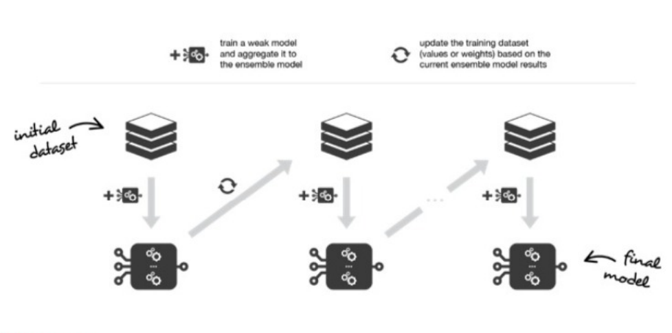
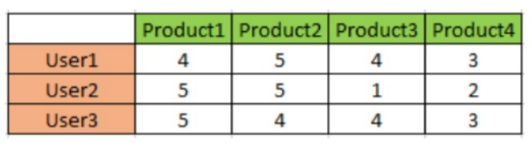
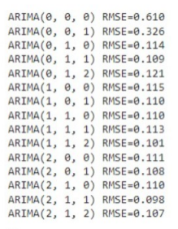

## Quiz Data Science

#### Q1. Diketahui relu keju -> susu memiliki support 30% dan confidence 70%. Makna yang tepat adalah...

- \[x] Konsumen yang membeli keju mempunyai kemungkinan 70% untuk membeli susu
- \[ ] Terdapat 30% dari seluruh transaksi yang tidak memuat susu
- \[ ] Konsumen yang membeli jeju mempunyai kemungkinan 30% untuk membeli susu
- \[ ] Terdapat 70% dari seluruh transaksi yang memuat keju dan susu

#### Q2. Tahapan pre-processing terdapat beberapa tahap didalamnya, kecuali...

- \[ ] Data Transformation
- \[x] Data Modeling
- \[ ] Data Reduction
- \[ ] Data Cleaning

#### Q3. Apabila suatu dataset asli memiliki dimensi ukuran 150x100 dilakukan reduksi dimensi dengan mengekstrak fiturnya menjadi 2 fitur, maka hasil setelah reduksi dimensi memiliki ukuran...

- \[ ] 100x2
- \[x] 150x2
- \[ ] 2x100
- \[ ] 2x150

#### Q4. Model ARIMA memiliki orde (p,d,q). Lag pada kurva PACF digunakan untuk melihat nilai dari orde...

- \[ ] p
- \[ ] d
- \[ ] s
- \[x] q

#### Q5. Algoritma di bawah ini yang menggunakan "stump" sebagai weak learner adalah ...

- \[x] Adaboost
- \[ ] Random Forest
- \[ ] k-Nearest Neighbor
- \[ ] Support Vector Machine

#### Q6. Pernyataan berikut yang salah terkait recommender system, yakni ...

- \[ ] User-based adalah merekomendasikan item dengan melihat kemiripan sekelompok pengguna dengan active-user (pengguna yang ingin diberi rekomendasi)
- \[x] Model-based adalah merekomendasikan berdasarkan item yang disukai (yang diberi nilai tinggi) oleh pengguna target
- \[ ] Item-based adalah merekomendasikan dengan didasari dengan melihat kesamaan antar item menggunakan rating/penilaian dari pengguna
- \[ ] User-based dan item-based merupakan metode yang termasuk dalam collaborative filtering

#### Q7. Pengertian dari dimensionality reduction adalah...

- \[x] Ekstraksi fitur data
- \[ ] Mengurangi sumber data
- \[ ] Ekstraksi baris data
- \[ ] Memperbaiki informasi data

#### Q8. Ensemble technique yang proses learningnya menggabungkan beberapa model prediksi berdasar meta-predictor yang berupa ide sederhana disebut teknik...

- \[ ] Tracking
- \[ ] Boosting
- \[ ] Bagging
- \[x] Stacking

#### Q9. Untuk visualisasi data berupa maps pada Tableau, memerlukan adanya longitude dan latitude. Pada menu manakah longitude dan latitude dimasukkan?

- \[x] Longitude: Columns, Latitude: Rows
- \[ ] Longitude: Pages, Latitude: Marks
- \[ ] Longitude: Marks, Latitude: Filters
- \[ ] Longitude: Rows, Latitude: Columns

#### Q10. Ilustrasi berikut merupakan ilustrasi dari ensemble technique untuk teknik....    

- \[x] Boosting
- \[ ] Stacking
- \[ ] Bagging
- \[ ] Tracking

#### Q11. Jika terdapat data pengamatan berupa data kategorik, jenis chart yang tidak sesuai digunakan adalah...

- \[ ] Tree maps
- \[x] Line chart
- \[ ] Pie chart
- \[ ] Bar chart

#### Q12. Data time series paling tepat menggunakan tipe chart/grafik...

- \[x] Line chart 
- \[ ] Bar chart
- \[ ] Pie chart
- \[ ] Histogram

#### Q13. Berdasarkan data berikut:  
* User1 memiliki similaristas dengan User2 sebesar 0,594
* User1 memiliki similaritas dengan User3 sebesar 0,5
* User2 memberi rating 4 terhadap product5
* User3 memberi rating 3 terhadap product5
 

#### Berapa rating yang akan diberikan User1 terhadap product 5? (menggunakan weighted average dengan threshold 40%) 

- \[ ] 1
- \[ ] 2
- \[ ] 5
- \[x] 3

#### Q14. Pernyataan tentang algoritma apriori berikut adalah benar, kecuali...

- \[ ] Algoritma yang menghasilkan aturan asosiatif dalam suatu transaksi
- \[ ] Algoritma dasar yang diusulkan oleh Agrawal dan Srikant
- \[x] Algoritma yang lebih baik dibandingkan association rules
- \[ ] Diusulkan pada tahun 1994 untuk penentuan frequent itemsets untuk aturan asosiasi boolean

#### Q15. Di bawah ini yang bukan kelebihan dari Algoritma Random Forest adalah....

- \[ ] Tahan dan kuat terhadap data outlier
- \[x] Tidak cocok untuk data berdimensi tinggi
- \[ ] Bisa menangani hubungan variable bebas dan variabel terikat yang nonlinier
- \[ ] Memberikan hasil yang cukup baik dalam klasifikasi dan regresi

#### Q16. Karakteristik sebuah matriks dimana arahnya tidak berubah meski dilakukan transformasi disebut....

- \[ ] Matrix Identitas
- \[ ] Invers Matriks
- \[x] Vektor Eigen
- \[ ] Determinan Matriks

#### Q17. Berikut merupakan metode machine learning yang dapat digunakan untuk klasifikasi, kecuali...

- \[ ] Logistic regression
- \[ ] Naive Bayes
- \[ ] Decision Tree
- \[x] Linear Regression

#### Q18. Uji stasioneritas menggunakan uji...

- \[ ] Heteroscedascity test
- \[ ] Wilcoxon test
- \[ ] Normality test
- \[x] Dicker-Fuller test

#### Q19. Beberapa manfaat dari proses visualisasi data, kecuali....

- \[ ] Mengetahui pola dari suatu data pengamatan
- \[x] Memperbaiki data yang tidak berdistribusi normal
- \[ ] Memudahkan klien dalam menerima informasi
- \[ ] Sebagai sarana interpretasi dari data.

#### Q20. Perbedaan teknik dimensionality reduction antara LDA dan PCA adalah...

- \[ ] PCA memerlukan vektor eigen, sedangkan LDA tidak memerlukan vektor eigen
- \[x] PCA tidak melibatkan label, sedangkan LDA melibatkan label
- \[ ] PCA tidak memerlukan nilai eigen, sedangkan LDA memerlukan nilai eigen
- \[ ] PCA memaksimalkan variansi, sedangkan LDA meminimalkan variansi

#### Q21. Pernyataan berikut merupakan pernyataan yang salah, yakni...

- \[ ] Jenis data berdasar skala pengukuran: nominal, ordinal, interval, rasio
- \[ ] Model regresi dapat digunakan untuk prediksi dan klasifikasi
- \[ ] Nilai invers suatu matrix digunakan untuk menentukan nilai optimum suatu persamaan
- \[x] K-Means Clustering termasuk dalam supervised learning

#### Q22. Data berdasar skala pengukuran terdapat beberapa jenis, kecuali...

- \[x] Primer
- \[ ] Nominal
- \[ ] Rasio
- \[ ] Ordinal

#### Q23. Output program berikut memberikan informasi untuk model terbaik adalah...   

- \[ ] ARIMA(1,1,2)
- \[ ] ARIMA(0,1,2)
- \[ ] ARIMA(2,1,2)
- \[x] ARIMA(2,1,1)

#### Q24. Yang dimaksud dengan vanishing gradient problem adalah ...

- \[x] Nilai gradient descent bisa "menghilang" bila memilih bobot yang lebih kecil dari 1 (< 1)
- \[ ] Nilai gradient descent bisa "meledak" secara eksponensial bila memilih bobot lebih besar dari 1 (> 1)
- \[ ] Nilai gradient descent bisa "meledak" secara eksponensial bila memilih bobot lebih besar dari 2 (> 2)
- \[ ] Nilai gradient descent bisa "menghilang" bila memilih bobot yang lebih besar dari 1 (> 1)

#### Q25. Model ARIMA memiliki orde (p,d,q). Jika d memiliki nilai 2, berarti....

- \[ ] Data memiliki pola pada ACF lag ke-2 sebagai cuts off
- \[x] Data dilakukan proses differencing sebanyak 2 kali
- \[ ] Data dilakukan proses transformasi sebanyak 1 kali
- \[ ] Data memiliki pola pada PACF lag ke-2 sebagai cuts off