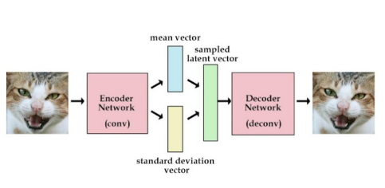
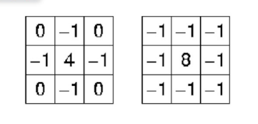
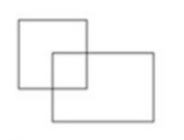
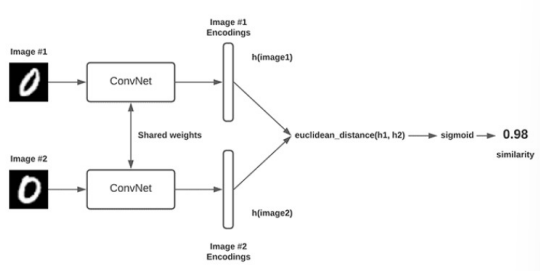
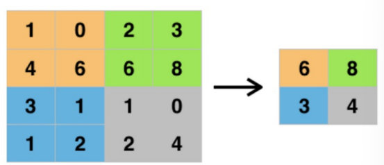
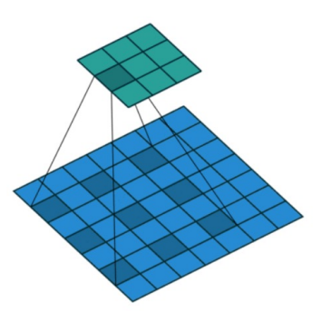
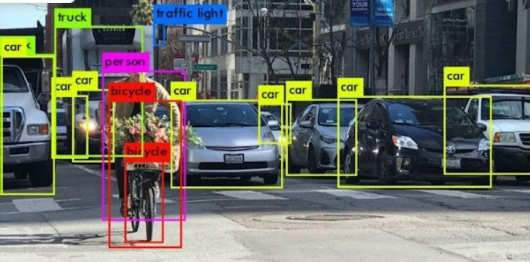
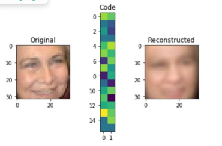

## Computer Vision

#### Q1. Gambar berikut ini merupakan pengembangan dari autoencoder yaitu?    

- \[ ] LSTM autoencoder
- \[ ] Sparse autoencoder
- \[x] Convolutional autoencoder
- \[ ] Variational autoencoder

#### Q2. Jika input layer CNN adalah (32x32x3), dilakukan konvolusi dengan filter (5x5), depth=8, stride=1. Berapa banyak jumlah parameter yang dihasilkan?

- \[ ] 808
- \[ ] 919
- \[ ] 760
- \[x] 608

#### Q3. Salah satu fungsi loss yang dapat digunakan apda Siamese neural network adalah...

- \[x] Triplet loss
- \[ ] One shot Learning 
- \[ ] Binary loss
- \[ ] Sigmoid loss

#### Q4. Berikut yang merupakan teknik untuk menyelesaikan masalah overfitting pada model CNN adalah...

- \[ ] Augmentasi data
- \[ ] Dropout optimization
- \[ ] Batch normalization
- \[x] Semuanya benar

#### Q5. Masukan dan keluaran dari computer vision adalah...

- \[x] Sinyal dan citra
- \[ ] Hanya sinyal
- \[ ] Hanya citra
- \[ ] Bergantung pada masukan nya

#### Q6. Apa nama filter pada gambar berikut yang biasa digunakan untuk memperbaiki kualitas citra?     

- \[ ] Laplacian filter
- \[x] Gaussian filter
- \[ ] Median filter
- \[ ] Canny filter

#### Q7. Berikut ini yang bukan merupakan pengembangan arsitektur CNN adalah...

- \[ ] AlexNet
- \[ ] DenseNet
- \[ ] VGG
- \[x] DotNet

#### Q8. Berapakah IoU antara dua kotak ini? Kotak kiri atas berukuran 2x2 dan kotak kanan bawah berukuran 2x3. Daerah overlapping adalah 1x1?     

- \[x] 1/9
- \[ ] 1/6
- \[ ] 1/10
- \[ ] 1/3

#### Q9. Berapa jumlah dimensi pada citra grayscale?

- \[x] 1
- \[ ] 2
- \[ ] 3
- \[ ] 4

#### Q10. Berikut merupakan kelebihan YOLO ketimbang Faster R-CNN sebagai object detection dan localization adalah...

- \[ ] Recall relative rendah ketimbang Faster R-CNN
- \[ ] Akurasi yang lebih tinggi ketimbang Faster R-CNN
- \[x] Waktu komputasi yang lebih cepat (mendekati real time) ketimbang Faster R-CNN
- \[ ] Lebih sedikit kesalahan lokalisasi ketimbang Faster R-CNN

#### Q11. Apa nama network pada gambar berikut ini?     

- \[ ] Autoencoder
- \[ ] Generative Adversarial Network
- \[x] Siamese Neural Network
- \[ ] Convolutional Neural Network

#### Q12. Kita memiliki citra dengan lebar 393 piksel dan tinggi 312 piksel, berapa resolusi yang dimiliki citra tersebut?

- \[ ] 367.848
- \[x] 122.616
- \[ ] 280.800 
- \[ ] 93.600

#### Q13. Zero padding membantu agar ukuran kernel dapat dibuat tidak bergantung kepada ukuran input. Berikut jenis strategi zero padding, kecuali...

- \[ ] Valid
- \[x] Similar
- \[ ] Same 
- \[ ] Full

#### Q14. Gambar berikut ini merupakan jenis pooling dari...     

- \[x] Max pooling
- \[ ] Avg pooling
- \[ ] Min pooling
- \[ ] Tidak ada jawabannya

#### Q15. Flatten() digunakan untuk mengubah multidimensi pada tensor menjadi 1-dimension

- \[x] Benar
- \[ ] Salah

#### Q16. Autoencoder merupakan teknik pembelajaran yang berbasis....

- \[ ] Supervised Learning
- \[x] Unsupervised Learning
- \[ ] Reinforcement Learning
- \[ ] Transfer Learning

#### Q17. Gambar berikut ini merupakan proses konvolusi, yaitu...     

- \[x] Dilated convolution
- \[ ] Erode convolution 
- \[ ] Down sampling
- \[ ] Up sampling

#### Q18. CNN memiliki tiga jenis lapisan (layers) untuk membangun arsitektur selain lapisan input, yaitu....

- \[x] Convolutional Layer, Pooling Layer, Fully Connected Layer
- \[ ] Convolutional Layer, ReLu Layer, Fully Connected Layer
- \[ ] Convolutional Layer, ReLu Layer, Pooling Layer
- \[ ] Convolutional Layer, Fully Connected Layer, Sigmoid

#### Q19. Berikut merupakan keuntungan dari penggunaaan Siamese Network, kecuali....

- \[ ] Cukup robust terhadap kelas yang tidak seimbang
- \[ ] Dapat belajar dari semantic similarity
- \[x] Waktu latih yang dibutuhkan sangat rendah
- \[ ] One shot learning

#### Q20. Gambar merupakan tugas dari Computer Vision, yaitu...   

- \[x] Object Localization
- \[ ] Object Classification
- \[ ] Object Segmentation
- \[ ] Object substraction

#### Q21. Underfitting adalah keadaan dimana akurasi dan loss pada fase testing lebih tinggi ketimbang fase training. Berikut merupakan cara untuk memperbaiki underfitting adalah...

- \[ ] Kurangi fitur
- \[x] Kurangi kompleksitas model
- \[ ] Tambahkan dropout
- \[ ] Tambahkan fitur dan jumlah layer

#### Q22. Anda telah melatih model Computer Vision untuk mengenali gambar kucing. Ini bekerja dengan sangat baik kecuali ketika mengidentifikasi kucing yang tidak berbulu, yang tidak dapat diklasifikasikan sama sekali. Apa yang mungkin menjadi masalah?

- \[ ] Kualitas gambar yang buruk
- \[x] Data latih tidak menampilkan gambar kucing yang tidak berbulu
- \[ ] Model computer vision yang kurang baik
- \[ ] Data pelatihan tidak memiliki cukup gambar kucing

#### Q23. Untuk membangun Siamese Network diperlukan ... dataset

- \[x] 3 anchor, positive, dan negative
- \[ ] 2 anchor dan positive
- \[ ] 2 anchor dan negative
- \[ ] 1 anchor

#### Q24. Autoencoder terdiri dari tiga komponen yaitu encoder, decoder, dan code. Berdasarkan gambar berikut ini, apa tugas utama dari code?     

- \[ ] Mempelajari cara mengompresi inpus asli menjadi encoding kecil
- \[ ] Mempelajari cara memulihkan data asli dari encoding
- \[x] Bagian jaringan yang mewakili input terkompresi
- \[ ] Bagian jaringan yang digunakan untuk mengkoreksi error

#### Q25. Apa yang dimaksud dengan piksel...

- \[x] Piksel adalah element dari citra digital
- \[ ] Piksel adalah element dari citra analog
- \[ ] Piksel adalah kumpulan dari citra digital
- \[ ] Piksel adalah kumpulan dari citra analog