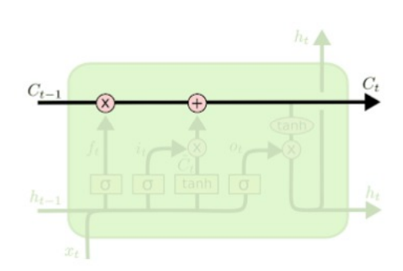

## Natural Language Processing

#### Q1. Komponen dari NLP adalah..

- \[ ] NLU dan NLP
- \[x] NLU dan NLG
- \[ ] NLA dan NLG
- \[ ] NLG dan NP

#### Q2. TF-IDF merepresentasikan...

- \[x] Pentingnya sebuah kata bagi sebuah dokumen dan kumpulan corpus
- \[ ] Kata dalam dokumen
- \[ ] Panjang dokumen
- \[ ] Semua benar

#### Q3. Mekanisme self-attention pada arsitektur transformers membutuhkan matrix...

- \[ ] Query
- \[ ] Key
- \[ ] Value
- \[x] Semua benar

#### Q4. Salah satu kelemahan metode hybrid pada seleksi fitur adalah...

- \[x] Membutuhkan waktu komputasi yang tinggi 
- \[ ] Masih terdapat banyak fitur noise
- \[ ] Sederhana
- \[ ] Performa akhir sangat buruk

#### Q5. Yang bukan contoh dari penerapan dan tugas pada NLU adalah...

- \[x] Generative open-domain chatbot 
- \[ ] Sentiment Analysis
- \[ ] Named Entity Recognition (NER)
- \[ ] Question Answering System

#### Q6. Manakah dari teknik berikut yang dapat digunakan untuk tujuan normalisasi kata dengan mengubah kata menjadi bentuk dasarnya?   
1. Stemming
2. Lemmatization
3. Levenshtein 
 

- \[ ] 1
- \[x] 1 & 2
- \[ ] 1,2,3
- \[ ] 2

#### Q7. Dalam paradigma transfer learning pengurangan kebutuhan data dan komputasi yang tinggi dapat dicapai.

- \[x] Benar
- \[ ] Salah

#### Q8. Kekurangan pendekatan tradisional Bag-of-Words dan TF-IDF adalah...

- \[x] Menghasilkan matrix yang sparse
- \[ ] Memiliki semantik yang tinggi
- \[ ] Mampu menangani masalah out-of-vocabulary
- \[ ] Menghasilkan matrix yang dense

#### Q9. Berapa banyak kombinasi "uni-gram dan bi-gram" yang dapat dihasilkan dari kalimat berikut: "Joni sedang belajar di Orbit Future Academy" ...

- \[ ] 6
- \[ ] 8
- \[x] 13
- \[ ] 10

#### Q10. Yang bukan algoritma yang dapat digunakan untuk topic modelling adalah...

- \[ ] LDA (Latent Dirichlet Allocation)
- \[ ] LSA (Latent Semantic Analysis)
- \[ ] K-Means
- \[x] Decision Tree

#### Q11. Inisialisasi bobot awal bersifat random saat training Word2Vec.

- \[x] Benar
- \[ ] Salah

#### Q12. Pendekatan berbasis RNN memiliki kekurangan tidak dapat menangkap konteks dari sebuah kalimat dapat ditangani menggunakan mekanisme ...

- \[ ] Word Embedding
- \[x] Attention
- \[ ] ELMo
- \[ ] TF-IDF dan Bag-of-Words

#### Q13. BERT menggunakan teknik tokenizer...

- \[x] WordPiece Tokenizer
- \[ ] Byte Pair Encoding (BPE) Tokenizer
- \[ ] Word-Based Tokenizer
- \[ ] Semua salah

#### Q14. AutoRegressive (AR) dan AutoEncoding (AE) model bergantung pada tugas dan strategi pelatihannya, bukan pada arsitektur modelnya.

- \[ ] Benar
- \[x] Salah

#### Q15. Out of Vocabulary problem dapat diselesaikan dengan pendekatan Word Embedding ...

- \[ ] FastText
- \[ ] Glove
- \[x] TF-IDF
- \[ ] Word2Vec

#### Q16. Tantangan utama NLP adalah....

- \[x] Menangani ambiguitas pada kalimat
- \[ ] Menangani tokenisasi
- \[ ] Menangani POS-Tagging
- \[ ] Semua benar

#### Q17. Kekurangan pendekatan berbasis lexicon untuk tugas klasifikasi teks adalah...

- \[ ] Dimensi fitur yang tinggi
- \[x] Fitur yang noise
- \[ ] Membutuhkan data berlabel
- \[ ] Harus memiliki korpus yang mengandung semua kata

#### Q18. Bagaimana urutan yang tepat membangun model untuk klasifikasi teks dengan machine learning?  
1. Modelling
2. Data Acquisition
3. Text Preprocessing
4. Model Tuning
5. Feature Extraction
 

- \[ ] 1-2-3-4-5 
- \[ ] 4-3-5-1-2
- \[x] 2-3-5-1-4
- \[ ] 3-2-1-5-4

#### Q19. Metode seleksi fitur yang berinteraksi langsung dengan classifier dan menggunakan fungsi fitness untuk mengevaluasi setiap fitur adalah...

- \[ ] Filter
- \[ ] QER
- \[ ] Hybrid
- \[x] Wrapper

#### Q20. Model dilatih pada tugas yang sama tetapi data berlabel hanya ada pada sourec domain adalah tipe transfer learning...

- \[x] Transductive learning
- \[ ] Inductive Learning
- \[ ] Multi-task Learning
- \[ ] Sequential Transfer Learning

#### Q21. Word2Vec adalah model pembelajaran mesin yang digunakan untuk membuat vektor dari objek teks. Word2Vec berisi beberapa jaringan saraf dalam.

- \[x] Benar
- \[ ] Salah

#### Q22. Arsitektur transformer menggunakan lapisan RNN.

- \[ ] Benar 
- \[x] Salah 

#### Q23. Ide utama arsitektur LSTM adalah terdapat mekanisme mengingat informasi yang penting atau melupakan informasi yang tidak relevan lagi dengan operasi elemen-wise product, disebut....   

- \[x] Cell State
- \[ ] Forget Gate
- \[ ] Input Gate
- \[ ] Hidden State

#### Q24. Manakah dari pernyataan berikut yang BENAR untuk model Word2Vec...

- \[ ] Arsitektur Word2Vec hanya terdiri dari dua lapisan
- \[ ] Continuous Bag-Of-Word (CBOW) adalah jenis Recurrent Neural Network
- \[x] CBOW dan Skip-gram adalah Shallow Neural Network
- \[ ] Semua salah

#### Q25. BERT pada dasarnya tidak dapat digunakan untuk downstreak task...

- \[x] Text generation
- \[ ] Sequence text classification
- \[ ] NER
- \[ ] Text Summarization