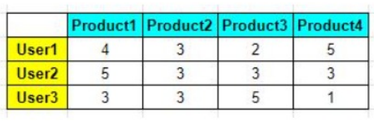
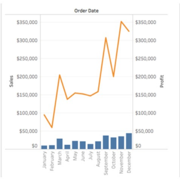
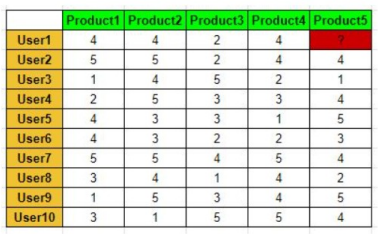

## Ujian Teori Data Science

#### Q1. Pernyataan berikut yang tepat terkait nilai similaritas dari data tabel berikut menggunakan Cosine Similarity adalah ...    

- \[ ] Similaritas User1 dan User2 adalah 0,7812
- \[x] Similaritas User2 dan User3 adalah 0,8780
- \[ ] Semuanya Salah
- \[ ] Similaritas User1 dan User3 adalah 0,5982

#### Q2. Untuk visualisasi berupa chart berikut pada tableau, manakah variabel yang tepat pada rows dan columns?    

- \[ ] Rows: Months; Columns: CountD(Sales) dan CountD(Profit)
- \[x] Rows: Months; Columns: SUM(Sales) dan SUM(Profit)
- \[ ] Rows: SUM(Sales) dan SUM(Profit); Columns: Months
- \[ ] Rows: CountD(Sales) dan CountD(Profit); Columns: Months

#### Q3. Berikut merupakan metode machine learning yang dapat digunakan untuk prediksi, kecuali...

- \[x] Decision Tree
- \[ ] Random Forest
- \[ ] Logistic Regression
- \[ ] Linear Regression

#### Q4. Berdasar dari data berikut diperoleh informasi similaritas:
* User1 dan User2 = 0.895
* User1 dan User3 = 0.457
* User1 dan User4 = 0.671
* User1 dan User5 = 0.755
* User1 dan User6 = 0.661
* User1 dan User7 = 0.571
* User1 dan User8 = 0.475
* User1 dan User9 = 0.467
* User1 dan User10 = 0.362

Rating yang akan diberikan oleh User1 terhadap Product5 dengan teknik rata-rata dan threshold 0,5 adalah....
 

  

- \[ ] 2
- \[ ] 3
- \[x] 4
- \[ ] 5

#### Q5. Apabila diketahui rule roti -> selai memiliki support 25%, confidence 65%, dan lift 85%. Maka pernyataan berikut yang tepat adalah .... 

- \[ ] Konsumen yang membeli roti memiliki kemungkinan 85% untuk membeli selai, karena roti dan selai berkorelasi positif
- \[x] Konsumen yang membeli roti memiliki kemungkinan 65% untuk membeli selai, serta sebanyak 156 dari 624 memuat roti dan selai
- \[ ] Sebanyak 31 dari 124 transaksi memuat roti dan selai, serta konsumen yang membeli roti terdapat kemungkinan 35% untuk membeli selai
- \[ ] Produk roti dan selai berkorelasi negatif, dan konsumen yang membeli selai memiliki kemungkinan 65% untuk membeli roti

#### Q6. Yang dimaksud dengan vanishing gradient problem adalah ...

- \[ ] Nilai gradient descent bisa "meledak" secara eksponensial bila memilih bobot lebih besar dari 1 (> 1)
- \[ ] Nilai gradient descent bisa "meledak" secara eksponensial bila memilih bobot lebih besar dari 2 (> 2) 
- \[ ] Nilai gradient descent bisa "menghilang" bila memilih bobot yang lebih besar dari 1 (> 1) 
- \[x] Nilai gradient descent bisa "menghilang" bila memilih bobot yang lebih kecil dari 1 (< 1)

#### Q7. Suatu nilai input x = 0.2, dikarenakan fungsi aktivasi Tanh, maka akan diperoleh nilai... [!Q07image](images/question07.png) 

- \[x] 0.1973...
- \[ ] 0.0021...
- \[ ] 0.6712...
- \[ ] 0.8912...

#### Q8. Teknik PCA pada Python merupakan bagian dari library.... 

- \[ ] pandas
- \[x] sklearn
- \[ ] math 
- \[ ] scipy

#### Q9. Ilustrasi berikut merupakan ilustrasi dari ensemble technique untuk teknik.... [!Q09image](images/question09.png) 

- \[ ] Boosting
- \[ ] Tracking
- \[x] Bagging
- \[ ] Stacking

#### Q10. Ensemble Technique yang proses learningnya menggabungkan beberapa model prediksi berdasar meta-predictor yang berupa ide sederhana disebut teknik.... 

- \[ ] Boosting
- \[ ] Tracking
- \[ ] Bagging
- \[x] Stacking

#### Q11. Pernyataan berikut yang salah terkait recommender system, yakni....

- \[ ] User-based adalah merekomendasikan item dengan melihat kemiripan sekelompok pengguna dengan active-user (pengguna yang ingin diberi rekomendasi)
- \[x] Model-based adalah merekomendasikan berdasarkan item yang disukai (yang diberi nilai tinggi) oleh pengguna target
- \[ ] Item-based adalah merekomendasikan dengan didasari dengan melihat kesamaan antar item menggunakan rating/penilaian dari pengguna
- \[ ] User-based dan item-based merupakan metode yang termasuk dalam collaborative filtering

#### Q12. Pernyataan berikut merupakan pernyataan yang salah, yakni...

- \[ ] Jenis data berdasar skala pengukuran: nominal, ordinal, interval, rasio
- \[ ] Model regresi dapat digunakan untuk prediksi dan klasifikasi
- \[ ] Nilai invers suatu matrix digunakan untuk menentukan nilai optimum suatu persamaan
- \[x] K-Means Clustering termasuk dalam supervised learning

#### Q13. Di bawah ini yang kelemahan dari Algoritma Random Forest adalah....

- \[ ] Tahan dan kuat terhadap data outlier
- \[x] Tidak cocok untuk data berdimensi tinggi
- \[ ] Bisa menangani hubungan variable bebas dan variabel terikat yang nonlinier
- \[ ] Memberikan hasil yang cukup baik dalam klasifikasi dan regresi

#### Q14. Suatu dataset memuat 3 variabel x,y, dan z. Ketiga variabel tersebut menghasilkan matriks kovarians seperti berikut. Informasi yang diperoleh dari matriks yang salah adalah.... [!Q14image](images/question14.png) 

- \[x] Variansi dari varibel x adalah 0.532
- \[ ] Variansi dari variabel z adalah 0.550
- \[ ] Kovariansi variabel x dan y adalah 0.159
- \[ ] Kovariansi variabel y dan z adalah 0.136

#### Q15. Informasi yang tepat dari output program berikut adalah... [!Q15image](images/question15.png) 

- \[x] Model AR(2) merupakan model yang terbaik 
- \[ ] Model AR(1) dengan 1 kali differencing lebih baik daripada model MA(1)
- \[ ] Model ARMA(2,1) merupakan model yang terbaik
- \[ ] Model ARMA(1,1) tidak lebih baik daripada model ARIMA(1,0,0)

#### Q16. Tabel berikut menunjukkan nilai aktual dan hasil prediksi dari empat model time series. Menggunakan RMSE, pernyataan berikut yang tepat adalah.... [!Q16image](images/question16.png) 

- \[ ] RMSE hasil prediksi model2 terhadap data aktual bernilai 0.3947...
- \[ ] Hasil prediksi model1 lebih baik daripada hasil prediksi model2
- \[x] RMSE hasil prediksi model3 terhadap data aktual bernilai 0.2828...
- \[ ] Hasil prediksi model3 lebih buruk daripada hasil prediksi model4

#### Q17. Jenis chart yang paling tepat untuk menggambarkan hubungan 2 variabel numerik adalah... 

- \[ ] Tree chart
- \[x] Scatter Plot
- \[ ] Bar Chart
- \[ ] Box Plot

#### Q18. Dibawah ini merupakan pernyataan yang kurang tepat mengenai tableau public adalah....

- \[ ] Tidak membutuhkan untuk terhubung dengan sumber data
- \[ ] Sumber data hanya dari Excel dan Text Files
- \[ ] Tidak berbayar
- \[x] Seluruh laporan akan otomatis menjadi akses public ketika disimpan

#### Q19. Informasi berikut tidak menjadi output dari fungsi describe() pada python, yakni...

- \[ ] Mean
- \[ ] Standar Deviasi
- \[x] Modus
- \[ ] Median

#### Q20. Model ARIMA memiliki orde(p,d,q). Jika p memiliki nilai 0, d memiliki nilai 0, dan q memiliki nilai 1 berarti....

- \[ ] Data memiliki pola pada PACF lag ke-3 sebagai cuts off
- \[ ] Data memiliki pola pada ACF lag ke-2 sebagai cuts off
- \[x] Data membentuk model MA(1)
- \[ ] Data dilakukan proses differencing sebanyak 1 kali

#### Q21. Apabila suatu dataset asli memiliki dimensi ukuran 75x50 dilakukan reduksi dimensi dengan mengekstrak fiturnya menjadi 3 fitur, maka hasil setelah reduksi dimensi memiliki dimensi ukuran...

- \[ ] 50x3
- \[x] 75x3
- \[ ] 3x75
- \[ ] 3x50

#### Q22. Berikut pernyataan yang salah mengenai keputusan dalam membeli mobil berdasar gambar berikut adalah.... [!Q22image](images/question22.png)  

- \[ ] Membeli mobil jika warna mobil biru dan merupakan model keluaran diatas tahun 2015 
- \[ ] Tidak membeli mobil jika warna mobil bukan biru dan bukan merah
- \[x] Tidak membeli mobil jika warna mobil biru, model mobil keluaran sebelum tahun 2015, dan jarak tempuh kurang dari 50000 KM
- \[ ] Membeli mobil jika mobil merupakan model ferrari merah

#### Q23. Untuk visualisasi data berupa maps pada Tableau, memerlukan adanya longitude dan latitude. Pada menu manakah longitude dan latitude dimasukkan?

- \[x] Longitude: Columns, Latitude: Rows
- \[ ] Longitude: Pages, Latitude: Marks
- \[ ] Longitude: Marks, Latitude: Filters
- \[ ] Longitude: Rows, Latitude: Columns

#### Q24. Karakteristik sebuah matriks dimana arahnya tidak berubah meski dilakukan transformasi disebut....

- \[ ] Matriks Identitas
- \[ ] Invers Matriks
- \[x] Vektor Eigen
- \[ ] Determinan Matriks

#### Q25. Yang merupakan contoh model ensemble sekuensial adalah...

- \[x] AdaBoost
- \[ ] Boostrapping
- \[ ] Random Forest
- \[ ] Semua Benar