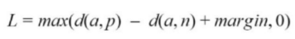
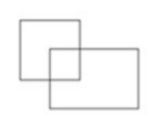
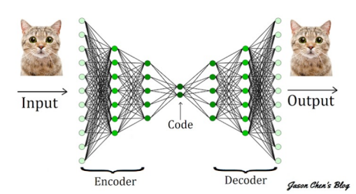
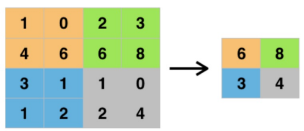

## Ujian Teori Computer Vision

#### Q1. Equation dibawah merupakan loss function yang digunakan pada Siamese Neural Network. Formula d(a,p) adalah?  

- \[x] Jarak antara citra anchor dan positif
- \[ ] Jarak antara citra anchor dan negatif
- \[ ] Jarak antara citra positif dan negatif
- \[ ] margin

#### Q2. Apa kepanjangan dari JPEG 

- \[ ] Joint photographic expansion group
- \[x] Joint photographic experts group
- \[ ] Joint photographic expanded group
- \[ ] Joint photgraphic explanaible group

#### Q3. Berikut yang merupakan statemen benar terkait CNN>

- \[ ] CNN hanya dapat diaplikasikan pada data image
- \[x] CNN dapat diaplikasikan pada setiap data 2D dan 3D
- \[ ] CNN hanya dapat diaplikasikan pada data text 
- \[ ] CNN hanya dapat diaplikasikan pada data text dan image

#### Q4. Tujuan dari activation function adalah untuk? 

- \[ ] Mengurangi dimensi pada network 
- \[x] Mengatasi non-linearity pada network
- \[ ] Mengatasi linearity pada network
- \[ ] Semuanya benar

#### Q5. Berikut yang merupakan jenis operasi gambar apa yang dapat dilakukan convolution?

- \[x] Edge Detection
- \[x] Sharpening
- \[x] Blurring

#### Q6. Berapakah IoU antara dua kotak ini? Kotak kiri atas berukuran 2x2 dan kotak kanan bawah berukuran 2x3. Daerah overlapping adalah 1x1?  

- \[x] 1/9
- \[ ] 1/6
- \[ ] 1/10
- \[ ] 1/3

#### Q7. Popularitas dari self-driving car telah meningkat secara eksponensial selama dekade terakhir. Berdasarkan yang telah kamu pelajari. Berikut yang merupakan teknik computer vision pada self-driving car?

- \[x] Object Detection 
- \[ ] Motion Transfer
- \[x] Image Classification

#### Q8. ....adalah salah satu fungsi loss yang dapat digunakan pada Siamese Neural Network?

- \[x] Triplet loss
- \[ ] Regression loss
- \[ ] Binary loss
- \[ ] Sigmoid loss

#### Q9. Kamu telah melatih model visi komputer untuk mengenali gambar kucing. Ini bekerja dengan sangat baik kecuali ketika diperlihatkan kucing yang tidak berbulu. Apa yang mungkin menjadi masalah?

- \[ ] Kualitas citra yang buruk
- \[x] Data pelatihan tidak menampilkan gambar kucing tidak berbulu
- \[ ] Model computer vision yang cacat
- \[ ] Data pelatihan tidak memiliki cukup gambar kucing

#### Q10. Autoencoder terdiri dari tiga komponen yaitu encoder, decoder, dan code. Berdasarkan gambar dibawah, apa tugas utama dari code?  

- \[ ] Mempelajari cara mengompresi input asli menjadi encoding kecil
- \[ ] Mempelajari cara memulihkan data asli dari encoding
- \[x] Bagian jaringan yang mewakili input terkompresi
- \[ ] Bagian jaringan yang digunakan untuk mengkoreksi error

#### Q11. Autoencoder merupakan teknik pembelajaran yang berbasis... 

- \[ ] Supervised learning
- \[x] Unsupervised learning
- \[ ] Reinforcement learning
- \[ ] Transfer learning

#### Q12. Pertimbangkan actual bounding box dan kotak predicted bounding box. Fungsi loss apa yang akan anda gunakan untuk menentukan kinerja keluaran model anda? 

- \[ ] Menyimpannya dari beberapa algoritma
- \[ ] Classification Loss
- \[x] Box Regression Loss
- \[ ] Squared Loss

#### Q13. CNN memiliki tiga jenis lapisan (layers) untuk membangun arsitektur selain lapisan input, yaitu? 

- \[x] Convolutional Layer, Pooling Layer, Fully Connected Layer 
- \[ ] Convolutional Layer, ReLu Layer, Fully Connected Layer
- \[ ] Convolutional Layer, ReLu Layer, Pooling Layer
- \[ ] Convolutional Layer, Fully Connected Layer, Sigmoid

#### Q14. U-Net terdiri dari tiga bagian yaitu?   

- \[ ] Contracting, Bottlenect, Expanding
- \[ ] Downsampling, Bottlenect, Topsampling
- \[x] Downsampling, Midsampling, Upsampling
- \[ ] Contracting, Bottlenect, Path

#### Q15. Kamu melatih sebuah object classification dan mendapatkan akurasi 50% pada training data dan 100% pada validation data. Hal ini merupakan contoh dari? 

- \[x] Overfitting
- \[ ] Underfitting
- \[ ] Good Model

#### Q16. Berikut yang bukan merupakan pengembangan arsitektur CNN adalah... 

- \[ ] AlexNet
- \[ ] DenseNet
- \[ ] VGG
- \[x] Dot Net

#### Q17. Berikut merupakan keuntungan dari penggunaan Siamese Network, kecuali?

- \[ ] Cukup robust terhadap kelas yang tidak seimbang
- \[ ] Dapat belajar dari semantic similarity
- \[x] Waktu latih yang dibutuhkan sangat rendah
- \[ ] One shot learning

#### Q18. Penggunaan kembali model yang telah dilatih sebelumnya pada masalah baru merupakan penjelasan dari?

- \[ ] Supervised Learning
- \[x] Transfer Learning
- \[ ] Reinforcement Learning
- \[ ] Meta Learning

#### Q19. Deteksi tumor pada X-Ray merupakan aplikasi dari Computer Vision? 

- \[x] Benar 
- \[ ] Salah

#### Q20. Berikut merupakan penerapan dari siamese neural network

- \[x] Face Recognition 
- \[ ] Image denoising
- \[x] Fingerprint verification 
- \[ ] Spoof Face Classification

#### Q21. Berikut merupakan kelebihan YOLO ketimbang Faster R-CNN sebagai object detection dan localization? 

- \[ ] Recall relative rendah ketimbang Faster R-CNN
- \[ ] Akurasi yang lebih tinggi ketimbang Faster R-CNN
- \[x] Waktu komputasi yang lebih cepat (mendekati real time) ketimbang Faster R-CNN  
- \[ ] Lebih sedikit kesalahan lokalisasi ketimbang Faster R-CNN

#### Q22. Gambar dibwah merupakan jenis pooling dari?  

- \[x] Max Pooling 
- \[ ] Avg Pooling
- \[ ] Min Pooling
- \[ ] Tidak ada jawabannya

#### Q23. Seringkali, kami tidak memiliki waktu dan sumber daya untuk membangun model kami sendiri, jadi kami menggunakan CNN yang telah dilatih sebelumnya untuk mempercepat prosesnya. Ini merupakan penjelasan dari? 

- \[x] Transfer Learning
- \[ ] Deep Learning
- \[ ] SVM
- \[ ] VGG16

#### Q24. Berikut merupakan masalah yang terdapat pada sliding window (naive approach pada object detection)?

- \[x] Aspect Ratio
- \[x] Object Size 
- \[x] Overlapping Objects 
- \[ ] Grayscale Image

#### Q25. Berikut yang merupakan pernyataan benar untuk Conv2dTranspose? 

- \[x] Operasi konvolusi yang kernelnya dipelajari saat melatih model
- \[ ] Penskalaan gambar sederhana dengan menggunakan tetangga terdekat tanpa mempelajari kernel
- \[ ] Mengurangi dimensi feature maps 
- \[ ] Image Scaling